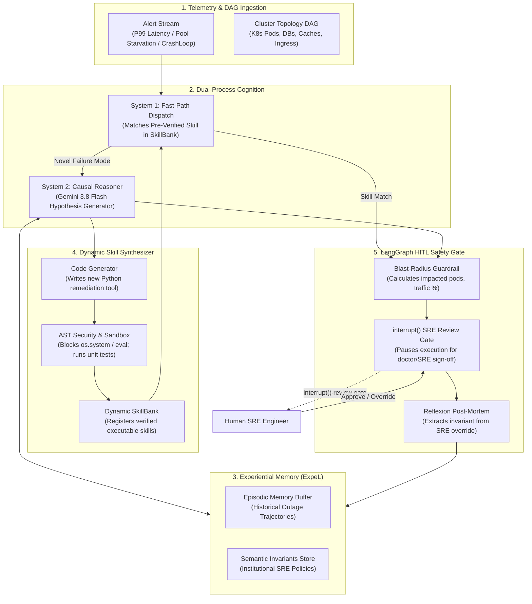

# Aegis-SRE: Autonomous Incident Response & Runbook Synthesis Engine

[](https://www.python.org/)
[](https://github.com/langchain-ai/langgraph)
[](https://modelcontextprotocol.io/)
[](docs/DESIGN_RFC.md)
[-emerald.svg)](tests/)
[](LICENSE)

> **Aegis-SRE** is an automated Site Reliability Engineering (SRE) incident remediation agent. It combines **fast-path heuristics (<20ms) for known failure patterns**, **Gemini 3.8 Flash causal reasoning for novel outages**, **sandboxed dynamic remediation scripts (Code-as-Skill)**, and **an institutional memory store** that indexes human SRE overrides so the system does not repeat mistakes.

---

## Technical Overview: Heuristics vs. Causal Reasoning in Production

While static rule-based routing works well for routine alerts, complex distributed systems outages involve cascading failures that require dependency-aware causal reasoning:

| Capability | Static Heuristic Scripts | Aegis-SRE |
| :--- | :--- | :--- |
| **Response Architecture** | Static pattern match only | **Dual-Process**: Fast path (<20ms) + Gemini 3.8 Flash causal reasoner |
| **Continuous Adaptation** | ❌ Manual runbook updates required | ✅ **Experience Store**: Records operator overrides as institutional invariants |
| **Skill / Script Synthesis**| ❌ Fixed toolset | ✅ **Sandboxed Execution**: Synthesizes verified remediation tools with AST safety checks |
| **Root Cause Analysis** | ❌ Single-point alert matching | ✅ **Dependency DAG Traversal**: Evaluates cascading microservice failures |
| **Safety Governance** | ❌ Unbounded automated execution | ✅ **LangGraph `interrupt()`**: Pauses at blast-radius review gate for SRE sign-off |
| **Stateful Infrastructure** | ❌ Risk of naive DB restarts | ✅ **Deterministic Invariants**: Code-level blocking of primary database restarts |

---

## 🏛️ System Architecture



---

## 📸 Operations Console & Live Incident Telemetry

A high-density operations console designed for incident commanders: live microservice topology graphs, terminal output streams, deterministic safety guardrails, and dynamic skill synthesizers.

### 1. Incident War Room & System 2 Diagnosis
Displays active alert telemetry (Payment Orchestrator 504 Timeouts), cluster topology DAG, System 2 causal hypothesis generation, and the LangGraph state machine paused at the `interrupt()` SRE review gate.


---

### 2. Microservice Topology & Service Mesh
Visualizes real-time dependency DAGs across Kubernetes pods, databases, caches, and ingress controllers, highlighting cascading failure paths and blast radius impact.


---

### 3. Deterministic Blast-Radius Guardrail
Demonstrates deterministic safety invariants: naive restarts on stateful infrastructure (`postgres-primary`) are intercepted and physically blocked by the Blast Radius Guard with a high-visibility warning banner.


---

### 4. Dynamic Skill Synthesizer (Code-as-Skill Sandbox)
Shows real-time Python skill synthesis: when encountering a novel incident signature, the agent writes a custom mitigation script, verifies it against AST security rules, runs sandboxed unit tests, and commits it to the dynamic SkillBank.


---

### 5. Reflexion & Institutional Memory (ExpeL Kernel)
Demonstrates continuous self-learning: when an SRE overrides the proposal, the Reflexion engine analyzes the delta, extracts an institutional invariant, and registers a new procedural skill so the outage is never repeated.


---

## 🧪 Verification & Test Suite (21 / 21 Passed)

Run the full automated test suite:

```bash
python -m pytest tests/ -v
```

```
============================= test session starts =============================
tests/test_blast_radius.py::test_find_downstream_dependents PASSED       [  4%]
tests/test_blast_radius.py::test_blocks_stateful_service_restart PASSED  [  9%]
tests/test_blast_radius.py::test_detects_tier1_traffic_exposure PASSED   [ 14%]
tests/test_blast_radius.py::test_blocks_violating_redundancy PASSED      [ 19%]
tests/test_blast_radius.py::test_blocks_destructive_action_without_rollback_plan PASSED [ 23%]
tests/test_graph.py::test_system1_fast_path_bypasses_deliberate_reasoning PASSED [ 28%]
tests/test_graph.py::test_system2_pauses_at_sre_review_gate PASSED       [ 33%]
tests/test_graph.py::test_graph_resumes_with_sre_override_and_learns PASSED [ 38%]
tests/test_mcp.py::test_mcp_resources PASSED                             [ 42%]
tests/test_mcp.py::test_mcp_query_service_health PASSED                  [ 47%]
tests/test_mcp.py::test_mcp_calculate_blast_radius PASSED                [ 52%]
tests/test_mcp.py::test_mcp_execute_skill PASSED                         [ 57%]
tests/test_mcp.py::test_mcp_synthesize_procedural_skill PASSED           [ 61%]
tests/test_reflexion.py::test_initial_invariants_seeded PASSED           [ 66%]
tests/test_reflexion.py::test_reflexion_distills_override_and_synthesizes_skill PASSED [ 71%]
tests/test_skill_bank.py::test_builtin_skills_seeded PASSED              [ 76%]
tests/test_skill_bank.py::test_ast_blocks_os_system PASSED               [ 80%]
tests/test_skill_bank.py::test_ast_blocks_eval_and_exec PASSED           [ 85%]
tests/test_skill_bank.py::test_sandboxed_test_runner_passes_valid_code PASSED [ 90%]
tests/test_skill_bank.py::test_sandboxed_test_runner_catches_assertion_error PASSED [ 95%]
tests/test_skill_bank.py::test_dynamic_registration_and_execution PASSED [100%]
============================= 21 passed in 1.01s ==============================
```

---

## 🛠️ Quickstart

### 1. Start the Aegis-SRE Platform
```bash
uvicorn app.main:app --port 8020 --reload
```
Open **[http://127.0.0.1:8020](http://127.0.0.1:8020)** in your browser.

### 2. Start the MCP Server
```bash
python -m mcp_server.server
```

---

## Engineering Attribution & AI Pair-Programming

This repository was developed with Gemini and Claude as AI pair-programming assistants. I designed the architecture, the blast-radius topological safety rules, and the verification test suites, and reviewed all code.


