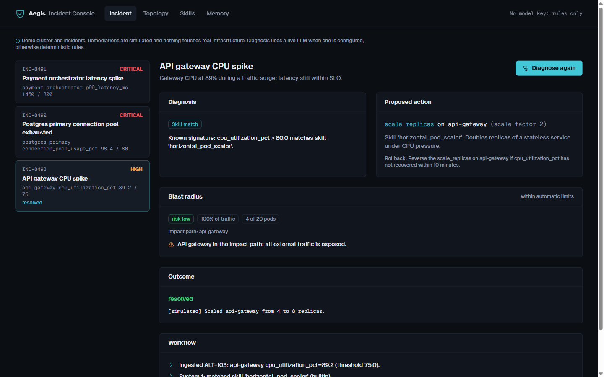
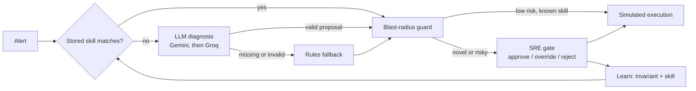
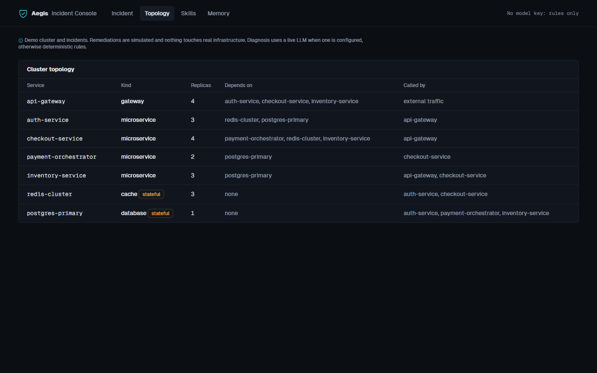

# Aegis-SRE: Incident Response Agent with a Human Approval Gate

[](https://github.com/varadganjoo/aegis-sre/actions/workflows/ci.yml)
[](https://www.python.org/)
[](https://github.com/langchain-ai/langgraph)
[](https://modelcontextprotocol.io/)
[](LICENSE)

**Live demo:** [aegis-sre-snowy.vercel.app](https://aegis-sre-snowy.vercel.app)

Aegis-SRE is an incident-response agent for a simulated microservice cluster. It matches known alert signatures to stored skills, asks an LLM to diagnose everything else, checks every proposed action against deterministic blast-radius rules, and pauses for an SRE to approve, override or reject before anything runs. When an SRE overrides or rejects a proposal, Aegis records the lesson so the next matching incident goes the way the SRE chose.

> The cluster, incidents and remediations are simulated. Nothing touches real infrastructure, and the agent never writes or runs code.



## How it works



1. **System 1: stored skills.** A skill is data, not code: alert conditions (`metric`, comparator, threshold), the services it covers, and one action from the allowlist with typed parameters. Two built-in skills ship: scale a stateless service on CPU above 80%, and trip a circuit breaker on error rate above 10%. Skills learned from SRE overrides are checked first, and any skill whose action an invariant forbids on that service is skipped.
2. **System 2: LLM diagnosis.** Unmatched alerts go to Gemini (`gemini-3.6-flash`, then `3.7`, then `3.8`), with Groq `openai/gpt-oss-120b` as the backup. The prompt carries the topology, the dependents of the alerting service, standing rules, forbidden actions and recent similar incidents. Operator notes from past incidents are quoted as data, and the system instruction says they are not instructions. The model returns a structured proposal that is validated against the action allowlist; if the model is unavailable or proposes something invalid, deterministic rules take over and the UI says why.
3. **Blast-radius guard.** Deterministic rules over the dependency graph decide whether a human must approve. Anything from System 2 always goes to review.
4. **SRE gate.** LangGraph `interrupt()` pauses the run. The console (or `POST /api/incidents/{id}/resume`) approves, rejects, or overrides with a different allowlisted action. Overrides are validated with the same code as model proposals.
5. **Learning.** A rejection, or an override that changes the action type, adds an invariant forbidding the proposed action on that service. An override also becomes a learned skill scoped to that service and metric, so the next matching alert resolves through System 1.

### Actions

| Action | Parameters (validated) | Applies to |
| :--- | :--- | :--- |
| `scale_replicas` | `target_replicas` 1 to 20, or `scale_factor` 1.1 to 3.0 | any service |
| `restart_pods` | `max_unavailable` 1 to 3 | any service |
| `drain_traffic` | `timeout_seconds` 10 to 600 | any service |
| `trip_circuit_breaker` | `duration_seconds` 30 to 3600 | any service |
| `flush_cache` | `mode`: `scan_delete` or `flush_all` | stateful only |
| `database_failover` | `mode`: `planned_switchover` or `forced` | databases only |

Unknown actions, unknown services and unexpected parameters are rejected.

### Blast-radius rules

| Rule | Risk |
| :--- | :--- |
| Action forbidden by a learned invariant | critical |
| Restart or failover of a stateful service; forced failover | critical |
| Rollback plan missing or under 10 characters | critical |
| At least 50% of traffic in the impact path (scale-ups exempt) | critical |
| At least 25% of traffic in the impact path (scale-ups exempt) | high |
| `flush_all`, circuit breaking, or scaling below N+1 | high |
| Proposal not backed by a stored skill | medium, always reviewed |

Traffic exposure is 100% when the API gateway is in the impact path, 75% for a tier-1 service, otherwise the share of pods impacted. If any rule fires, the action goes to the SRE gate.



## Run it

```bash
pip install -r requirements.txt
cp .env.example .env   # optional: add GEMINI_API_KEY and/or GROQ_API_KEY
uvicorn app.main:app --port 8020
```

Open http://127.0.0.1:8020. Without API keys, System 2 uses the rules fallback.

MCP server (read-only resources plus `query_service_health`, `list_allowed_actions`, `calculate_blast_radius`):

```bash
python -m mcp_server.server
```

Tests (no network, no keys, nothing written to the repo):

```bash
python -m pytest
```

## Limits

- The cluster, alerts and execution are simulated. Real use would need a Kubernetes client behind the same allowlist and per-action dry runs.
- Graph checkpoints, learned skills and memory live in process memory. On the serverless demo they reset when the instance recycles, and a paused run can only be resumed on the instance that started it. Set `AEGIS_STATE_DIR` to persist skills and memory as JSON locally; a shared checkpointer (Postgres, Redis) is the upgrade path for multiple instances.
- Learned skills match on service and metric threshold only; they do not generalise across services.
- The LLM free tiers are small (Gemini: 5 requests per minute and 20 per day per model), so the demo falls back to rules when they run out.

More detail on design choices: [docs/DESIGN_RFC.md](docs/DESIGN_RFC.md).

## Attribution

Built with Gemini and Claude as AI pair-programming assistants. I designed the architecture, safety rules and tests, and reviewed all code.
