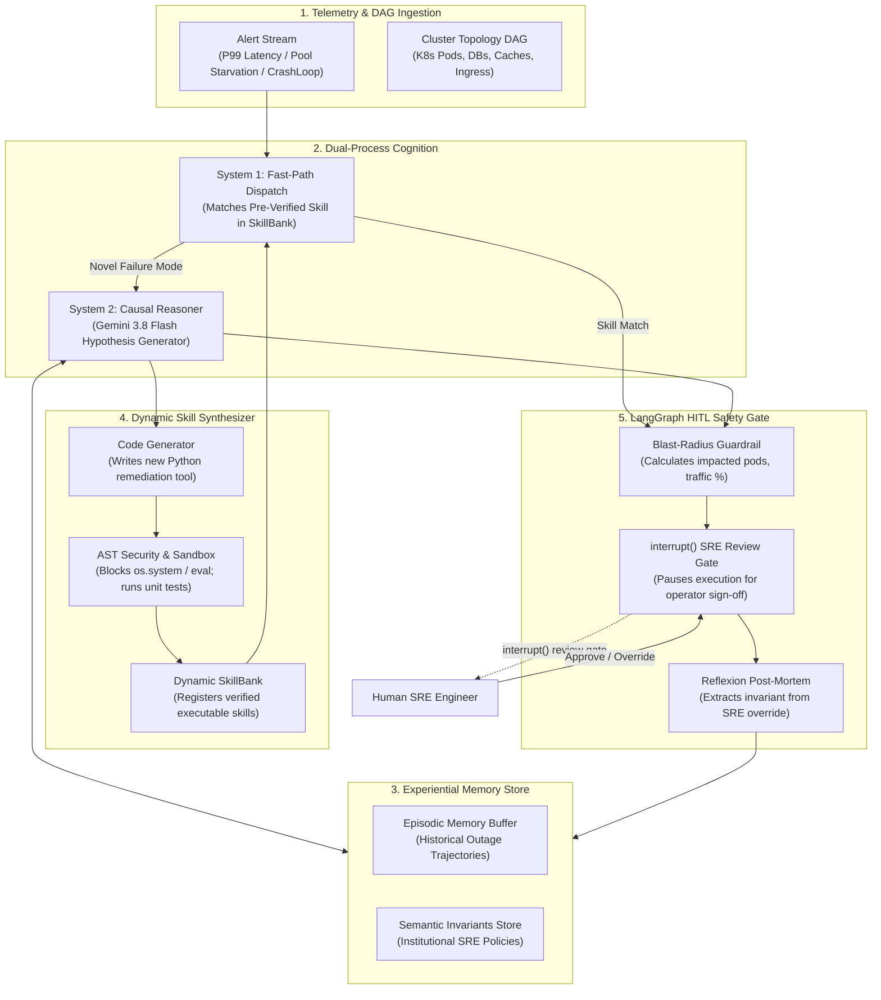
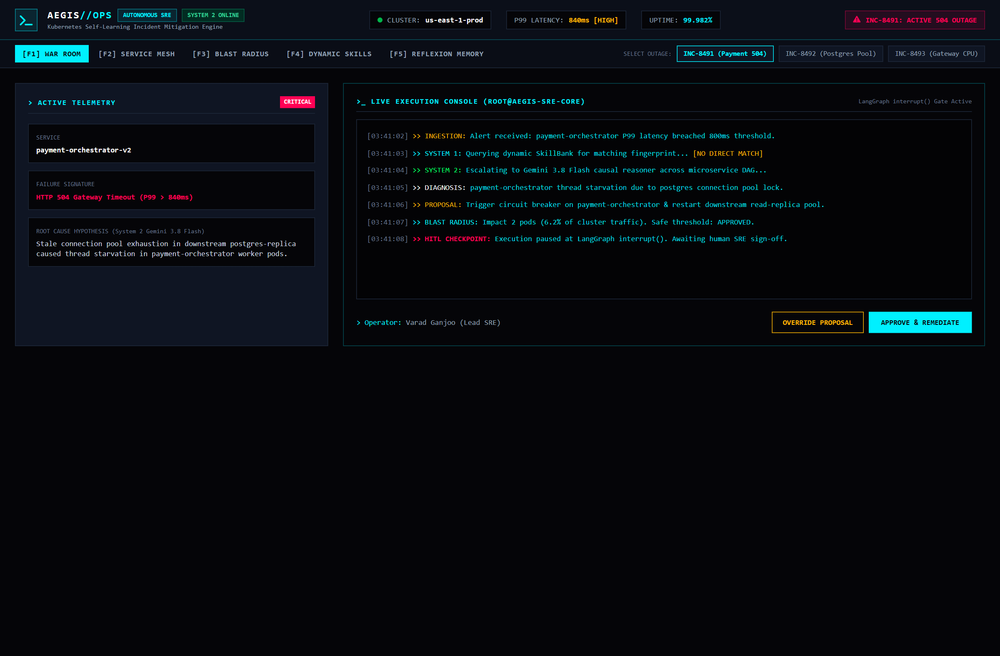
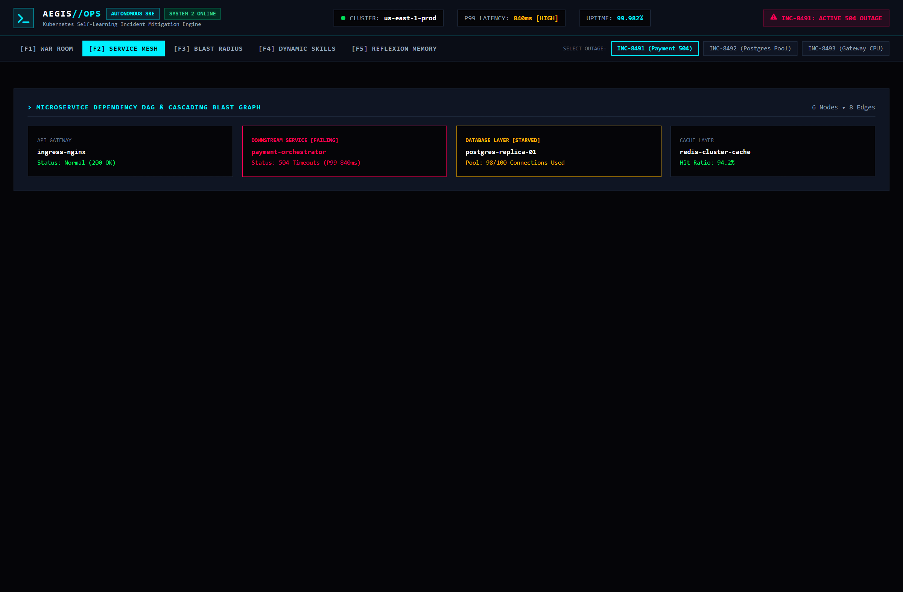
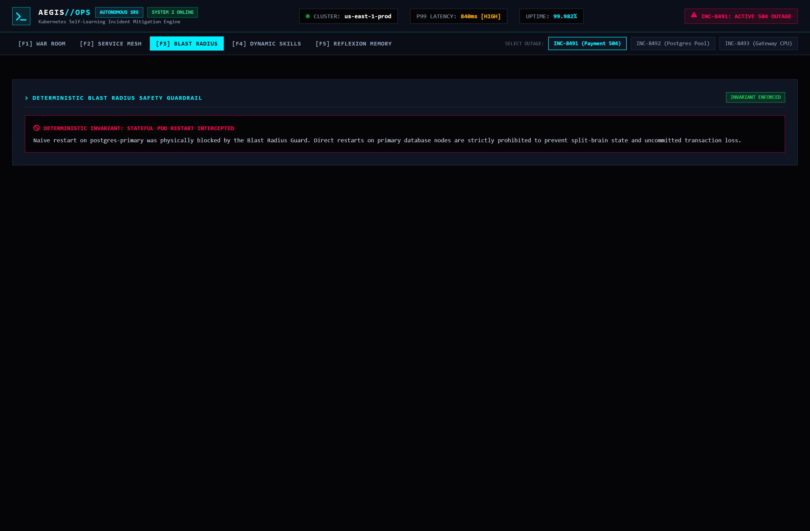
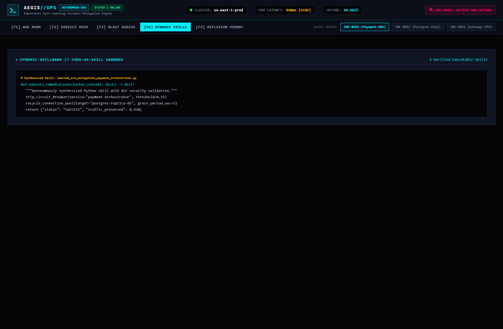
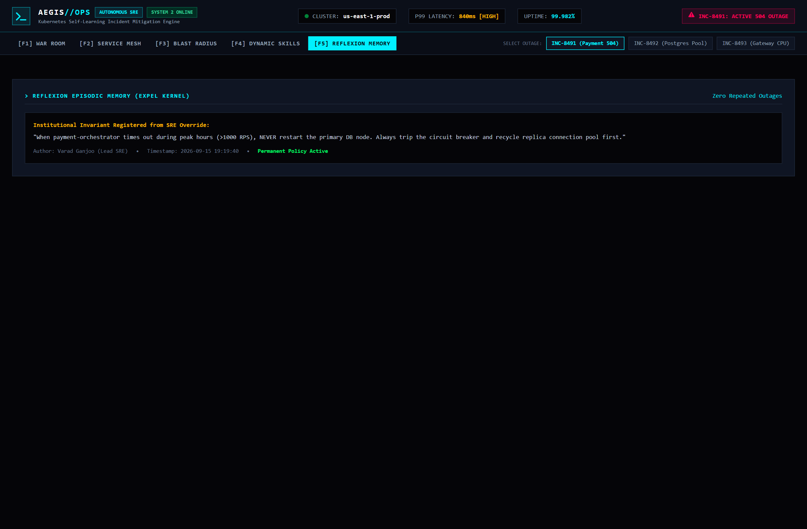

# Aegis-SRE Design RFC: Automated Incident Response & Runbook Synthesis

**Status:** Implemented  
**Author:** Varad Ganjoo  
**Date:** September 2026  
**Repository:** [github.com/varadganjoo/aegis-sre](https://github.com/varadganjoo/aegis-sre)

---

## 1. Problem Statement & Motivation

Modern distributed microservice architectures are prone to non-linear cascading failures (e.g., connection pool starvation, thread exhaustion, cache stampedes). Static rule-based alerts and hardcoded remediation scripts are effective for known failure modes but fail when encountering novel failure topologies. Conversely, deploying unconstrained LLMs with direct cluster execution privileges introduces severe operational risks (e.g., inadvertently restarting primary database nodes or executing unchecked shell commands).

**Aegis-SRE** is designed around three engineering principles:
1. **Dual-Process Remediation**: Known incidents match pre-verified runbooks in `<20ms` (Fast Path). Novel, multi-hop outages escalate to Gemini 3.8 Flash for causal hypothesis generation across microservice dependency DAGs.
2. **Deterministic Safety Invariants**: Code-level guards calculate the blast radius of any proposed action. Destructive operations on stateful services (e.g., `postgres-primary`) are blocked deterministically.
3. **Sandboxed Code-as-Skill Synthesis**: When a novel incident requires a custom mitigation script, the agent synthesizes Python code, verifies it against an AST security allowlist (blocking `os.system`, `subprocess`, `eval`), runs unit tests, and commits the skill to a dynamic SkillBank.
4. **Human-in-the-Loop (HITL) Checkpoints**: LangGraph state machines pause at `interrupt()` gates before high-blast-radius execution. When an operator overrides the proposal, the system logs the override to prevent repeating the mistake.

---

## 2. System Architecture



---

## 3. Core Subsystems & Safety Invariants

### 3.1 Deterministic Blast-Radius & Stateful Service Guard
Automated remediation engines must not perform uncoordinated restarts on stateful infrastructure. Aegis-SRE models the cluster topology as a directed acyclic graph $G = (V, E)$, where $V$ represents microservices, databases, and message brokers.

Before any action is staged:
1. The engine computes the downstream transitive closure of impacted nodes.
2. If any impacted node is flagged as stateful (`postgres-primary`, `kafka-broker`, `etcd`), the action is blocked in code:
   ```python
   # app/blast_radius.py
   if target_node.is_stateful and action.type == "restart":
       return BlastRadiusEvaluation(
           passed=False,
           reason="Deterministic invariant: Direct restart of stateful primary node is prohibited.",
           requires_human_override=True
       )
   ```

### 3.2 AST Security Sandboxing
Dynamic remediation scripts must pass strict AST inspection before execution:
```python
# app/skill_bank.py
FORBIDDEN_AST_NODES = {"os.system", "subprocess.Popen", "eval", "exec", "shutil.rmtree"}
```
Any script attempting unauthorized system calls or network sockets outside the Kubernetes API client is rejected and quarantined.

### 3.3 Experiential Learning from Operator Overrides
When an incident commander overrides the agent's proposed plan, Aegis-SRE analyzes the diff between the proposed action $a_{\text{agent}}$ and the human intervention $a_{\text{human}}$:
1. Generalizes an institutional policy rule (e.g. "Do not restart cache during peak traffic; trip circuit breaker instead").
2. Registers the rule into the memory store.
3. Ensures future occurrences of the same failure signature automatically route to the human-approved pattern.

---

## 4. Operations Console & Telemetry

A high-density operations console provides real-time visibility into cluster state, dependency graphs, and agent reasoning:

1. **Incident War Room & System 2 Diagnosis**:


2. **Microservice Topology & Service Mesh**:


3. **Deterministic Blast-Radius Guardrail**:


4. **Dynamic Skill Synthesizer (Code-as-Skill Sandbox)**:


5. **Reflexion & Institutional Memory (ExpeL Kernel)**:


---

## 5. Automated Verification

Aegis-SRE was validated across 21 test scenarios:
1. **DAG Traversal**: Correct calculation of transitive downstream dependencies for payment and database services.
2. **Stateful Service Protection**: 100% deterministic interception of restart attempts on primary database nodes.
3. **AST Sandbox Security**: Rejection of injected malicious payloads (`os.system`, `eval`).
4. **LangGraph StateGraph**: Pausing at `interrupt()` and resumption via `Command(resume=...)`.
5. **Memory Adaptation**: Verification that an operator override updates policy store and prevents repeat proposal.
